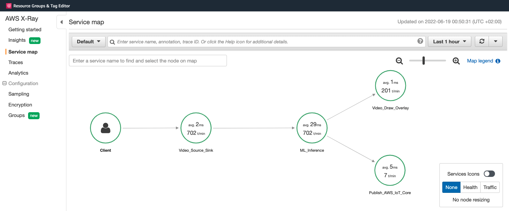
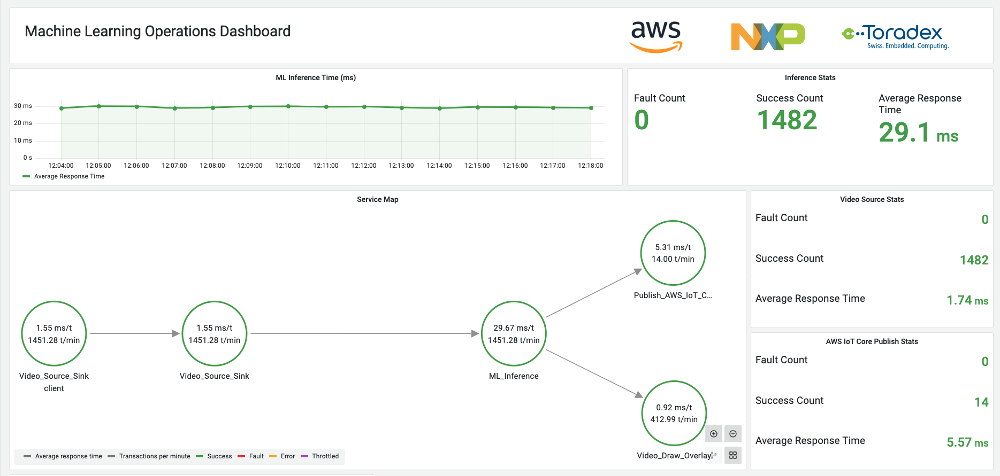
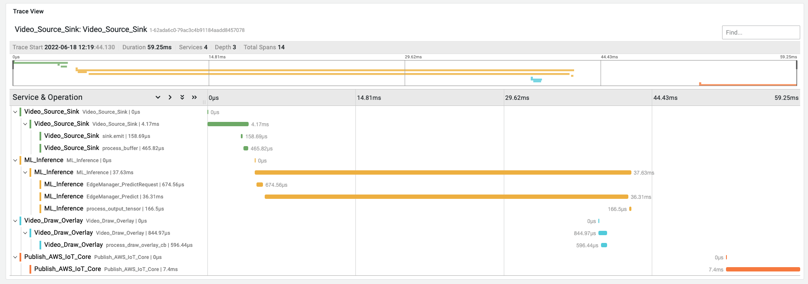

# aws-cloud-demo-torizon MLOps Components Deployment

_Author: Emir Ayar // emirayar@amazon.lu_

This folder contains the resources to deploy MLOps components to an existing demonstrator.
Please run these deployment only after having a running demo.

This deployment contain following steps:
- Read `project_settings.sh` and `project_config.sh` files to have the context of deployed resources. 
- (`001_publish_component_xray.sh`) : Publish X-Ray daemon as a Greengrass component `com.mlops.xray` version `1.1.0` 
- (`002_update_component_integration.sh`) : Get the latest `edgeManagerClientCameraIntegration` component recipe and deploy version `0.2.0` with following modifications:
  - Add `com.mlops.xray >= 1.1.0` as a HARD dependency
  - Update version to `0.2.0`
  - Upload one modified component source file to S3
  - Update source file URL
- (`003_attach_policy_for_xray.sh`) : Allow Greengrass to write segments to X-Ray service.
- (`004_revise_deployment.sh`) : Get the latest deployment for the device, update the component versions, include the new `com.mlops.xray` and deploy!


## Installation

Run scripts in order:
```
./001_publish_component_xray.sh
./002_update_component_integration.sh
./003_attach_policy_for_xray.sh
./004_revise_deployment.sh
```

If you have an installation on another folder or repository, you can bring this integration to your environment as well. Simply copy this folder recursively to your working folder:
```
cp -r mlops-deployment /path/to/your/aws-cloud-demo-torizon/
```


## Validate Installation

On the Maivin board, check if `com.mlops.xray` produces logs outputs as published segments, like the following:

```
$ tail -f /greengrass/v2/logs com.mlops.xray.log
...
2022-06-18T22:00:11.054Z [INFO] (Copier) com.mlops.xray: stdout. 2022-06-18T22:00:11Z [Info] Successfully sent batch of 50 segments (0.149 seconds). {scriptName=services.com.mlops.xray.lifecycle.Run, serviceName=com.mlops.xray, currentState=RUNNING}
2022-06-18T22:00:12.022Z [INFO] (Copier) com.mlops.xray: stdout. 2022-06-18T22:00:12Z [Info] Successfully sent batch of 50 segments (0.147 seconds). {scriptName=services.com.mlops.xray.lifecycle.Run, serviceName=com.mlops.xray, currentState=RUNNING}
...
```

Also, you can go to the AWS X-Ray console and check if the Service Map is built for last 5 - 10 minutes.




# Grafana Dashboard

## Setup

- Create an Amazon Managed Grafana instance
- Enable AWS X-Ray data source during installation
- Make yourself Admin on Grafana
- Login to Grafana instance with SSO
- Go to Configuration > Data Sources and click "AWS X-Ray \[Region\]" 
- Copy the `uid` of data source from URL. It's the last section of the URL. For the URL `https://g-a123456.grafana-workspace.eu-west-1.amazonaws.com/datasources/edit/abcf12345/`, the `uid` is `abcf12345`.
- Open `grafana/dashboard_json_model.json` file with your text editor and replace all `arn:aws:xray:eu-west-1:123456789012` occurrences with your region and account ID.
- Open `grafana/dashboard_json_model.json` file with your text editor and replace all `abcf12345` occurrences with your `uid`.
- Save the `grafana/dashboard_json_model.json` file.
- Go Dashboards > Browse and click Import button. Specify the modified json model file to import.

## Screenshots




